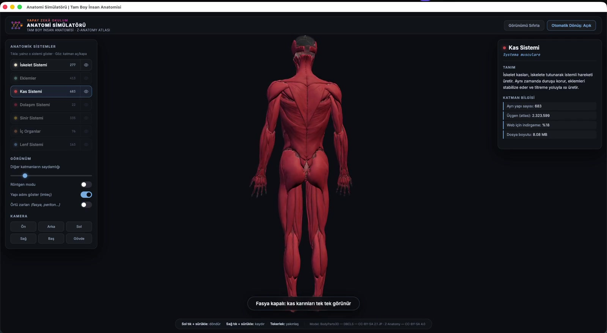
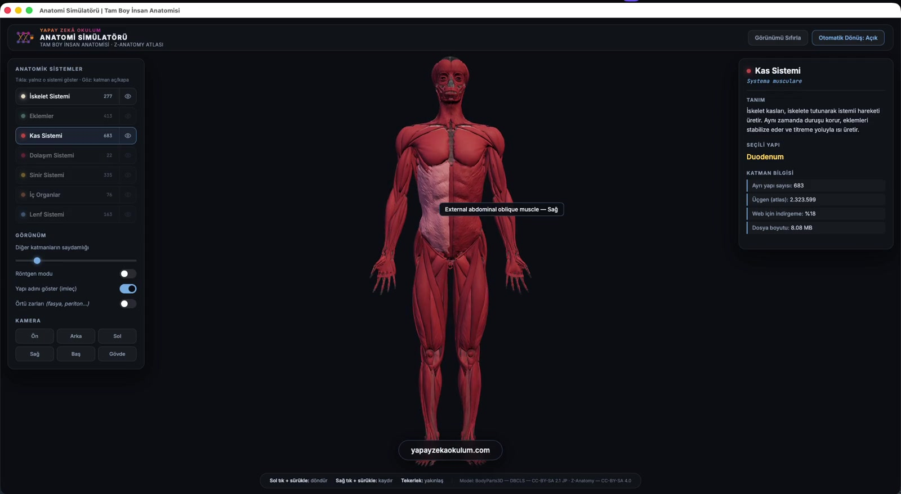

# Anatomi Simülatörü

Tarayıcıda çalışan, **Türkçe arayüzlü tam boy insan anatomisi görüntüleyicisi**.
Kurulum yok, hesap yok, sunucu yok — bir statik dosya sunucusu yeter.

7 anatomik sistem, **1.969 ayrı yapı**. Herhangi bir kemiğe, kasa ya da organa
tıklayın; adı anında görünür.



*[English summary below](#english)*

---

## Neden

Açık kaynak insan anatomisi verisi (BodyParts3D → Z-Anatomy) yıllardır mevcut ve
mükemmel. Tek engel şu: veri **293 MB'lık bir Blender dosyası**. Açmak için Blender
kurmanız ve Blender bilmeniz gerekiyor — yani öğretmenin eline geçmiyor.

Bu depo aradaki mesafeyi kapatıyor: aynı veri, **33 MB**, tarayıcıda, Türkçe.

## Öne çıkanlar

- **Tıklama kesin.** Yapı sınırları koordinat kurallarıyla *tahmin edilmiyor*; her
  kemik/kas/organ atlasta zaten ayrı obje ve etiketi doğrudan verinin kendisinden
  geliyor.
- **7 sistem, tembel yükleme.** Yalnız açtığınız katman indirilir.
- **10 çizim çağrısı.** 1,9 milyon üçgen tek `BufferGeometry`'de birleştirilir; buna
  rağmen ışın testi köşedeki `structureId`'den yapının gerçek adını okur.
- **Örtü zarları ayrı katman.** Fasya, periton, plevra, perikart — anatomik olarak
  doğru ama altındaki her şeyi örtüyorlar, o yüzden varsayılan kapalı.
- **Sağ/sol farkındalığı.** `.l` / `.r` ekleri "Sol" / "Sağ" olarak çözülür.
- **CDN yok.** three.js `vendor/` altında yerel; tamamen çevrimdışı çalışır.

| Sistem | Yapı | Üçgen | Boyut |
|---|---:|---:|---:|
| İskelet | 277 | 336.208 | 5,3 MB |
| Eklemler | 413 | 172.727 | 3,7 MB |
| Kas | 683 | 462.974 | 8,1 MB |
| Sinir | 335 | 350.478 | 6,3 MB |
| İç organlar | 76 | 260.638 | 4,7 MB |
| Lenf | 163 | 127.682 | 1,5 MB |
| Dolaşım | 22 | 189.336 | 3,4 MB |
| **Toplam** | **1.969** | **1.900.043** | **33 MB** |



## Çalıştırma

```bash
git clone https://github.com/DrMuratAltun/anatomi-simulatoru.git
cd anatomi-simulatoru
python3 server.py          # http://127.0.0.1:8092
```

Herhangi bir statik sunucu olur (`npx serve`, `python3 -m http.server`, nginx…).
ES modülleri kullanıldığı için `file://` ile **açılmaz**, HTTP gerekir.

Otomatik tanıtım turu: `http://127.0.0.1:8092/index.html?demo=1`

## Mimari

Sistem GLB'sinde yapılar ayrı mesh olarak gelir (683'e kadar) — bu kadar çizim
çağrısı ağır olurdu. Yükleme sırasında hepsi tek `BufferGeometry`'de birleştirilir
ve **her köşeye `structureId` yazılır**. Işın testi vurduğu üçgenin en yakın
köşesinden bu id'yi okuyup adı `names[]` dizisinden bulur.

Sonuç: sistem başına 1–2 çizim çağrısı, ama yapı düzeyinde tam çözünürlüklü
etkileşim.

## Veriyi yeniden üretmek

`systems/*.glb` depoda hazır geliyor. Kendiniz üretmek isterseniz:

```bash
# 1) Z-Anatomy atlasını indirin (86 MB zip → 293 MB .blend)
curl -L -o vendor/Z-Anatomy.zip \
  https://raw.githubusercontent.com/Z-Anatomy/Models-of-human-anatomy/master/Z-Anatomy.zip
unzip vendor/Z-Anatomy.zip -d vendor/

# 2) Blender headless ile dışa aktarın
ANATOMI_ROOT="$PWD" blender -b vendor/Z-Anatomy/Startup.blend \
  --factory-startup -noaudio -P tools/export_systems.py
```

Hedef üçgen sayıları `tools/export_systems.py` içindeki `SYSTEMS` listesinde.

### Boru hattında karşılaşılan dört tuzak

Kendi dışa aktarımınızı yazacaksanız bunlar zaman kazandırır:

1. **Subdivision modifier.** `len(obj.data.polygons)` ham sayıyı verir; gerçek üçgen
   sayısı 40 katına çıkabiliyor. Decimate oranını **depsgraph'tan değerlendirilmiş**
   sayıyla hesaplayın — yoksa 66 bin poligonluk katman 44 MB olarak çıkar.
2. **`use_selection=True` sızdırır.** Seçili objelerin *başka koleksiyonlardaki*
   çocuklarını da çeker (76 obje → 1648 node). Geçici koleksiyon +
   `use_active_collection` kullanın.
3. **three.js node adlarını sterilize eder.** `GLTFLoader`, animasyon bağlaması için
   noktaları siler: `Incus.l` → `Incusl`. Orijinal adı glTF JSON'undan
   `parser.associations` ile okuyun.
4. **Etiket objeleri.** Z-Anatomy sahnede yüzen 3B başlık yazıları içerir (`... .g`
   ekli). Anatomi değiller, dışa aktarımdan çıkarın.

## Lisans

| Ne | Lisans |
|---|---|
| Kaynak kod (`app.js`, `tools/` …) | **MIT** — [LICENSE](LICENSE) |
| 3B anatomi verisi (`systems/*.glb`) | **CC BY-SA 4.0** — [LICENSE-DATA.md](LICENSE-DATA.md) |
| `assets/yzo-mark.png` (marka) | Tüm hakları saklı — fork'ta değiştirin |

⚠️ **Veri ShareAlike'tır.** `systems/` içeriğini kullanan her türev çalışma da
CC BY-SA ile dağıtılmak zorundadır. Kapalı bir ürüne gömüp lisansı kapatamazsınız.

Zorunlu atıf ve kaynak zinciri: **[ATTRIBUTION.md](ATTRIBUTION.md)**

> BodyParts3D — The Database Center for Life Science (DBCLS) — CC BY-SA 2.1 Japan
> Z-Anatomy — The libre 3D atlas of anatomy — CC BY-SA 4.0

Anatominin kendisi onların emeği; bu depo yalnızca web'e taşıma katmanıdır.

## Bilinen sınırlar

- Yapı adları **Terminologia Anatomica** (İngilizce/Latince): `Stomach`, `Scapula.l`.
  Türkçe sözlük henüz yok — arayüz Türkçe, yapı adları değil.
- Kas sistemi %18 oranında indirgenmiş; kas sınırları biraz yumuşadı.
- Kaynak veri **anatomist denetiminden geçmemiş** ham Z-Anatomy'dir.
  [Open3Dmodel](https://anatomytool.org/open3dmodel) aynı veriyi uzman denetiminden
  geçirmiş (~%70 yeniden meshlenmiş) — daha yüksek doğruluk gerekiyorsa oraya bakın.
- Yalnız erkek anatomisi.

## Katkı

Türkçe yapı sözlüğü (`Stomach` → `Mide`) en çok ihtiyaç duyulan katkı. Anatomi
bilginiz varsa PR açın; TA2 hiyerarşisi Z-Anatomy'nin `TA2.csv` dosyasında.

---

<a name="english"></a>

## English

**Full-body human anatomy viewer that runs in the browser.** No installation, no
account, no build step — any static file server works.

7 anatomical systems, **1,969 individually clickable structures**. Turkish UI;
structure names are in Terminologia Anatomica.

The open anatomical data (BodyParts3D → Z-Anatomy) has existed for years, but it
ships as a **293 MB Blender file** — inaccessible to most teachers. This repo
converts it to **33 MB** of web-ready glTF and adds an interaction layer.

Structure picking is **exact, not heuristic**: every bone/muscle/organ is already a
separate object in the atlas, and the label comes straight from the data. All meshes
of a system are merged into one `BufferGeometry` with a per-vertex `structureId`, so
1.9M triangles render in ~10 draw calls while raycasting still resolves the precise
structure name.

```bash
git clone https://github.com/DrMuratAltun/anatomi-simulatoru.git
cd anatomi-simulatoru && python3 server.py   # http://127.0.0.1:8092
```

Code is MIT. **3D data is CC BY-SA 4.0** and derived from BodyParts3D (DBCLS) and
Z-Anatomy — attribution is mandatory and ShareAlike applies. See
[ATTRIBUTION.md](ATTRIBUTION.md).

---

Dr. Murat Altun — [Yapay Zekâ Okulum](https://yapayzekaokulum.com)
